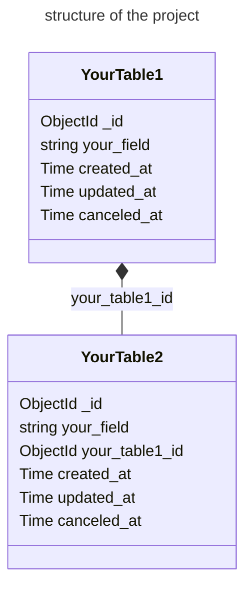

```mermaid
---
title: structure of the project
---
classDiagram
    class YourTable1 {
        ObjectId _id
        string your_field
        Time created_at
        Time updated_at
        Time canceled_at
    }
    class YourTable2 {
        ObjectId _id
        string your_field
        ObjectId your_table1_id
        Time created_at
        Time updated_at
        Time canceled_at
    }
    
    
    YourTable1 *-- YourTable2 : your_table1_id
    
```